# 🏛️ GOFS – e-VND: Governable Onchain Finance System

A revolutionary blockchain-based financial system that enables the government to maintain full oversight while unlocking access to global DeFi liquidity pools worth hundreds of billions of dollars.

## 🚀 Project Vision

The Governable-Onchain-Finance-System (GOFS) introduces e-VND as Vietnam's digital currency that bridges the gap between centralized monetary control and decentralized finance innovation. Our design enables the government to maintain full oversight while unlocking access to global DeFi liquidity pools worth hundreds of billions of dollars.

## ⭐ Revolutionary Properties

-   **🏛️ Sovereign Governance**: Multi-tier authority structure with real-time policy enforcement through smart contracts
-   **💰 DeFi Native Integration**: Full compatibility with existing DeFi protocols (Uniswap, Aave, Compound) to attract massive liquidity
-   **🔍 Complete Transparency**: On-chain governance with public verifiability of all policy decisions and enforcement
-   **⚖️ Automated Compliance**: Smart contract-based KYC/AML with configurable regulatory modules
-   **🌐 Cross-Border Ready**: Interoperable with other CBDCs and international payment systems
-   **📊 Real-Time Monitoring**: Comprehensive transaction tracking and anomaly detection capabilities
-   **🔐 Fault-Resilient**: Multi-layered security with proactive governance intervention capabilities

## 🏗️ Governance-First Architecture

Our design puts governance at the center, enabling seamless integration with global DeFi while maintaining sovereign control:

```mermaid
graph TB
    %% Governance Layer
    subgraph GovLayer ["🏛️ Vietnamese Monetary Authorities"]
        direction TB
        MGOV["🏛️ Monetary Governor<br/>Policy & Supply Control"]
        KGOV["🔎 KYC Governor<br/>Identity Oversight"]
        BGOV["🏦 Bank Governors<br/>Liquidity Management"]
        CGOV["⚖️ Compliance Governor<br/>Regulatory Enforcement"]
    end

    %% Smart Contract Layer
    subgraph ContractLayer ["🧊 Blockchain Infrastructure"]
        direction TB

        subgraph CoreContracts ["Core CBDC Infrastructure"]
            ER["🛂 Entity Registry<br/>National ID Integration"]
            CR["⚖️ Compliance Registry<br/>Policy Enforcement Engine"]
            CT["💵 e-VND Token<br/>DeFi-Compatible CBDC"]
            EP["🔄 Exchange Portal<br/>Multi-Currency Gateway"]
        end

        subgraph ComplianceModules ["Regulatory Modules"]
            VC["✅ Identity Verification"]
            SC["📊 Supply Controls"]
            AC["🚫 Sanctions Enforcement"]
            EC["👥 Entity Type Management"]
        end
    end

    %% DeFi Integration Layer
    subgraph DeFiLayer ["🌐 Global DeFi Integration"]
        direction TB
        DEFIS["🦄 Uniswap, 🏦 Aave, 💎 Compound,..."]
    end

    %% Application & Monitoring Layer
    subgraph AppLayer ["🖥️ Monitoring & Applications"]
        direction TB
        FDS["🛡️ Fault Detection System<br/>Real-time Monitoring"]
        EXP["🔍 Governance Explorer<br/>Public Transparency"]
        DAPP["📱 Citizen Applications<br/>User Interfaces"]
    end

    %% Governance flows
    MGOV -->|Sets Monetary Policies| CR
    KGOV -->|Manages National ID| ER
    BGOV -->|Controls Liquidity| CT
    CGOV -->|Updates Regulations| ComplianceModules

    %% Contract interactions
    CR -->|Enforces Policies| CT
    ER -->|Validates Citizens| CT
    ComplianceModules -->|Compliance Checks| CT
    CT <-->|Controlled Exchange| EP

    %% DeFi Integration - The Key Innovation
    CT <-->|Massive Liquidity Access| DeFiLayer
    EP <-->|Cross-Chain Bridges| DeFiLayer

    %% Monitoring
    AppLayer -.->|Tracks All Activity| ContractLayer
    AppLayer -.->|Reports to Authorities| GovLayer

    %% External Connections
    subgraph External ["🌍 Global Financial Ecosystem"]
        direction LR
        OtherCBDCs["Other CBDCs<br/>(China, Singapore, EU)"]
        Stablecoins["Major Stablecoins<br/>(USDT, USDC, DAI)"]
        TradFi["Traditional Banking<br/>Swift Integration"]
        Exchanges["Crypto Exchanges<br/>(Binance, Coinbase)"]
    end

    EP <-->|International Payments| External
    DeFiLayer <-->|Global Liquidity| External
```

### 🛠 Core Components

| Component             | Function              | Key Features                                     |
| --------------------- | --------------------- | ------------------------------------------------ |
| **Entity Registry**   | Identity management   | National ID integration, KYC verification        |
| **e-VND Token**       | Digital currency      | ERC-20 compatible, compliance-enforced transfers |
| **Compliance Engine** | Policy enforcement    | Modular rules, real-time validation              |
| **Exchange Portal**   | Currency conversion   | Multi-asset support, controlled rates            |
| **Monitoring System** | Transaction oversight | Real-time tracking, anomaly detection            |

## 🌌 Design Rationale

> The **Entity Registry** and **Monitoring System** establish comprehensive KYC/AML compliance and real-time oversight, creating a transparent environment that reduces regulatory risks while enabling controlled market access. The **e-VND Token**, governed by the **Compliance Engine**, implements dynamic policy enforcement through smart contracts, ensuring regulatory adherence while maintaining operational flexibility. The **Exchange Portal** bridges DeFi protocols with government oversight, enabling access to external liquidity pools while preserving monetary control. The modular compliance architecture allows for adaptive regulatory frameworks that can evolve with policy requirements. Together, these components create a CBDC system that combines the efficiency and liquidity of decentralized finance with the oversight and stability required for national monetary systems, demonstrating how blockchain technology can serve both innovation and governance objectives.

---

_This submission demonstrates how blockchain technology can serve national interests while embracing global innovation, positioning Vietnam at the forefront of the financial technology revolution._
