# 🌐 GOFS – e-VND: Vietnam’s Governable CBDC on EVM

A prototype for a government-backed, fully on-chain financial ecosystem with integrated governance, regulatory compliance, and a seamless user experience, designed to bridge centralized control with decentralized innovation.

## 🚀 Project Overview
The Governable-Onchain-Finance-System (GOFS) is a blockchain-based protocol designed as a Central Bank Digital Currency (CBDC) for a national government, with a focus on Vietnam’s vision to lead in blockchain technology. It combines the strengths of Decentralized Finance (DeFi) with centralized governance to address unregulated financial flows, harness on-chain liquidity, and promote economic growth.

## ⭐ Core Properties

- **Fully On-Chain**: Transparent execution of transactions and policies.  
- **Government-Managed**: Centralized oversight ensures compliance and strategic control.  
- **Fault-Resilient**: Real-time monitoring prevents fraud and ensures system integrity.  
- **Interoperable**: Connects with DeFi ecosystems to leverage global liquidity.  
- **Accessible**: Simplifies blockchain use for individuals and businesses. Adapt current KYC processes (citizenship verification) to the blockchain.

## 🖼 System Architecture

The architecture blends centralized governance with decentralized technology, centered around the **Central Monetary Policy Registry**:

```mermaid
graph TB
    %% G-Unit: Vietnam
    subgraph GUnitVN ["🌐 G-Unit: Vietnam"]
        %% On-Chain
        subgraph OnChain
            direction TB
            IDR["🛂 Identity Registry"]
            WALLET["👛 Entities (ERC-4337 Wallets)"]
            CBDCT["💵 CBDC-Token"]
            CMPR["📜 Central Monetary Policy Registry"]
            EXCH["🔄 External Exchange Portal"]

            IDR     -->|onboards| WALLET
            WALLET -->|transfer/payment| CBDCT
            WALLET -->|swap| EXCH
            CBDCT   -->|checks KYC| IDR
            CBDCT   -->|apply policy| CMPR
            CBDCT -->|mint/burn| EXCH
            CMPR -->|get info| IDR
        end

        %% Off-Chain
        subgraph OffChain
            direction TB

            KGOV["🔎 KYC Governor"]
            BGOV["🏦 Bank Governors"]
            MGOV["🏛 Monetary Governor"]

            subgraph FDS ["⚙️ Fault Detection System"]
                direction TB
                V1["⚙️ Validator Node 1 (monitors KYC)"]
                V2["⚙️ Validator Node 2 (monitors Exchange)"]
                V3["⚙️ Validator Node 3 (monitors CBDC-T)"]
                Vn["... ⚙️ Validator Node N"]
            end

            %% Governance flows
            KGOV -->|updates| IDR
            MGOV -->|apply policy| CMPR

            %% Banking interactions
            BGOV <-->|mint/burn| CBDCT

            %% Fault Detection
            FDS  -->|reports| IDR & CMPR & EXCH
        end

        %% Entity ⇄ Bank Governor link
        BGOV <-->|deposit/withdraw fiat| WALLET

    end

    %% External Connections (Moved after main graph to appear below)
    subgraph ExternalConnections ["External Connections"]
        direction RL
        GUnitOther["🌐 ... Other G-Units"]
        PublicTokens["✅ Public Tokens (USDT, USDC)"]
    end

    %% Cross-connections
    EXCH <-->|🪜 Cross–G-Unit Swap| GUnitOther
    EXCH <-->|🪜 Public Token Swap| PublicTokens
```

## 🛠 Key Components

| Component | Purpose | Details |
|-----------|---------|---------|
| 🛂 **Identity Registry** | Ensures KYC/AML compliance | Stores verified identities, restricting access to authorized users and enabling regulatory oversight |
| 👛 **Entities (ERC-4337 Wallets)** | User and organizational wallets | Smart contract wallets with ERC-4337 abstraction for seamless, user-friendly transactions, support typed entities (e.g. individual, organization, foreign entity,...)
| 💵 **CBDC-Token** | The system's digital currency | An enhanced ERC-20 token that enforces economic policies (e.g., taxes, supply rules) via the **Central Monetary Policy Registry**, support typed transactions |
| 📜 **Central Monetary Policy Registry** | Centralizes all economic policies | Defines monetary policies (e.g., money supply, currency exchange capacity).
| 🔄 **External Exchange Portal** | Facilitates currency conversions | Enables swaps between CBDC-Token and stablecoins (e.g., USDT, USDC) or other currencies, guided by the **Central Monetary Policy Registry** |
| ⚙️ **Fault Detection System (FDS)** | Maintains system security and compliance | Validator nodes monitor on-chain activities, detecting and addressing anomalies in real time |
| 🛠**Governors** | Off-chain entities providing oversight | - **🔠KYC Governor**: Manages identity verification - **🦠Bank Governors**: Handle fiat integration and token minting/burning - **🛠Monetary Governor**: Updates the **Central Monetary Policy Registry** |

### 🌌 Design Rationale
> The **Identity Registry** and **FDS** ensure robust KYC/AML compliance and real-time monitoring, fostering a transparent and secure environment that attracts foreign direct investment (FDI) and venture capital by mitigating risks of unregulated flows. The **CBDC-Token**, governed by the **Central Monetary Policy Registry**, enables dynamic economic policies, enhancing financial stability and supporting Vietnam's monetary sovereignty. The **External Exchange Portal** bridges DeFi and traditional finance by facilitating seamless currency swaps, unlocking global liquidity to fuel economic expansion. **ERC-4337 Wallets** simplify user access, driving widespread adoption across diverse populations. Guided by **Governors**, the system ensures strategic oversight, aligning with national priorities. Together, these components empower Vietnam to lead as a blockchain hub, promote transparency, integrate traditional and decentralized finance, and catalyze economic growth through increased liquidity and global investment.
