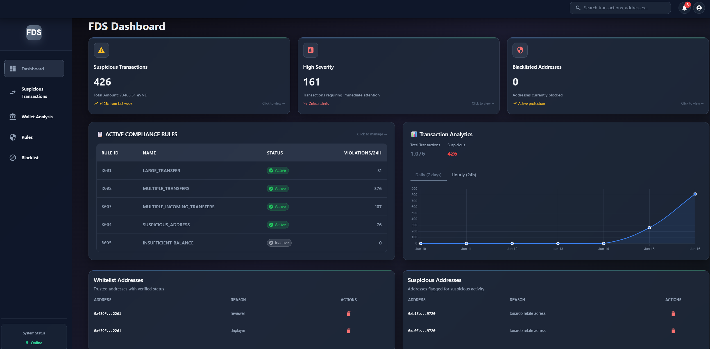
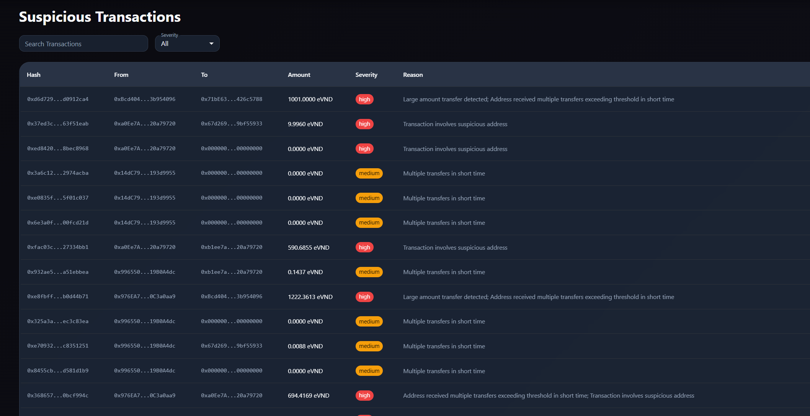
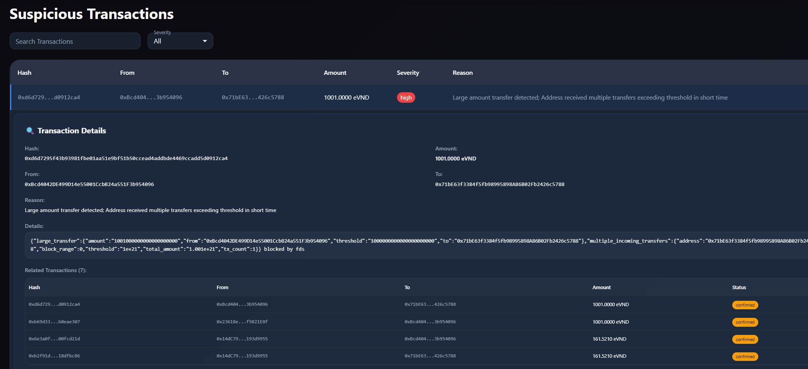
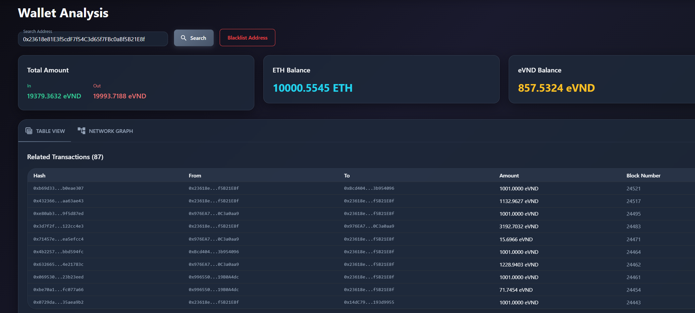
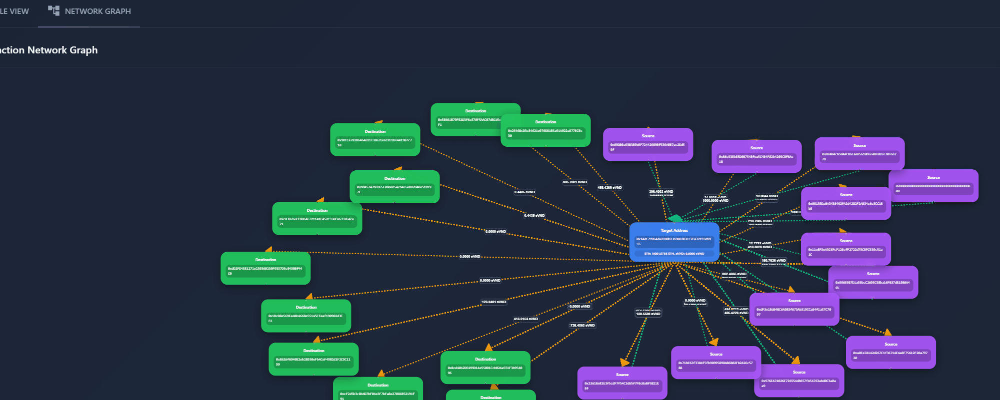
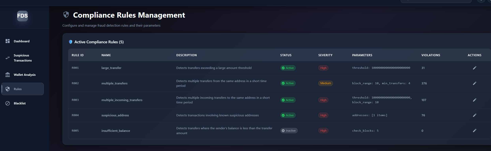
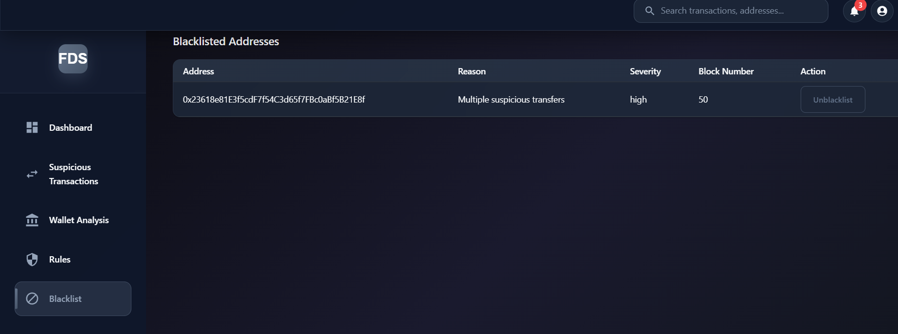

This Go project monitors blockchain transactions and detects abnormal activity, specifically focusing on ERC20 token transfers and automatic blacklisting of suspicious addresses.

## FDS Dashboard


### 1. Detect suspicious transactions in network 

Details relate supspicious transaction selected



### 2. View details transaction related addresses in network






### 3. Define rules to detect and take action relate suspicious transactions


### 4. Manage blacklisted address block by auto/manual 



###
To start fds:
```
docker-compose up --build -d
```