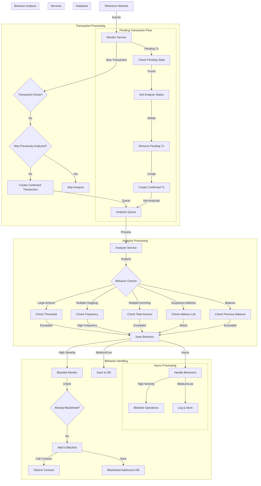

# Blockchain Transaction Monitor

This Go project monitors blockchain transactions and detects abnormal activity, specifically focusing on ERC20 token transfers and automatic blacklisting of suspicious addresses.

## Transaction Processing Workflow

### 1. Transaction Detection
- Monitor service listens to blockchain events
- When a transaction is detected:
  1. Check if transaction exists in transaction table
  2. If not found, check if it was previously analyzed in pending state
  3. Create new confirmed transaction
  4. If not previously analyzed, queue for analysis

### 2. Transaction Analysis
- Two types of transaction processing:

#### Pending Transactions
- Analyzed immediately when received
- Process:
  1. Analyze transaction for suspicious behaviors
  2. If suspicious behaviors found:
     - Create new suspicious transfer record
     - Handle behaviors asynchronously
  3. Update analyzed status in pending_transaction table
  4. Delete pending transaction after processing

#### Confirmed Transactions
- Added to analysis queue
- Processed by worker goroutine:
  1. Analyze transaction for suspicious behaviors
  2. If suspicious behaviors found:
     - Create new suspicious transfer record
     - Handle behaviors asynchronously
  3. Update analyzed status in transaction table

### 3. Suspicious Behavior Handling
- When suspicious behaviors are detected:
  1. Create new suspicious transfer record
  2. Update transaction analyzed status
  3. Handle behaviors asynchronously:
     - For high severity: Trigger blacklist operations
     - For medium/low severity: Log and store details

### 4. Blacklist Operations
- Triggered by high severity behaviors
- Process:
  1. Check if address is already blacklisted
  2. If not blacklisted:
     - Call blacklist function on contract
     - Wait for transaction confirmation
     - Update blacklist status in database
  3. Log operation result

## Features

- Real-time blockchain transaction monitoring
- ERC20 token transfer tracking
- Suspicious behavior detection:
  - Large amount transfers
  - Multiple transfers in short time
  - Transfers to/from suspicious addresses
- Automatic blacklisting of high-risk addresses
- Transaction storage and analysis
- Configurable monitoring parameters

## Prerequisites

- Go 1.21 or higher
- PostgreSQL database
- Ethereum node access (Infura or similar)
- Owner private key for blacklist operations

## Setup

1. Clone the repository
2. Copy `.env.example` to `.env` and fill in your configuration:
   ```bash
   cp .env.example .env
   ```
3. Install dependencies:
   ```bash
   go mod download
   ```
4. Configure your environment variables in `.env`:
   ```
   # Database
   DB_HOST=localhost
   DB_PORT=5432
   DB_USER=postgres
   DB_PASSWORD=your_password
   DB_NAME=token_monitor
   DB_SSLMODE=disable

   # Ethereum
   ETHEREUM_WS_URL=wss://your-node-url
   CONTRACT_ADDRESS=your-contract-address
   OWNER_PRIVATE_KEY=your-private-key

   # Monitoring
   LARGE_AMOUNT_THRESHOLD=1000
   SUSPICIOUS_ADDRESSES=addr1,addr2
   ```

5. Initialize the database:
   ```bash
   go run cmd/initdb/main.go
   ```

## Running the Monitor

```bash
go run cmd/monitor/main.go
```

## Development and Testing Setup

### 1. Start Local Ethereum Node (Anvil)

```bash
# Install Foundry if not already installed
curl -L https://foundry.paradigm.xyz | bash
foundryup

# Start Anvil with a specific block time (e.g., 2 seconds)
anvil --block-time 20 --port 8545
```

### 2. Deploy Compliance Token (OFS token)

```bash
# Deploy the token contract
forge script script/SimpleDeployAll.s.sol:SimpleDeployAll  --rpc-url 127.0.0.1:8545 --broadcast

# Note the deployed contract address and update your .env file
CONTRACT_ADDRESS=<eVND Token>
RESTRICT_CONTRACT_ADDRESS=<AddressRestrictionCompliance>
```

### 3. Run the Monitor

```bash
# In a new terminal, start the monitor
go run cmd/monitor/main.go
```

### 4. Test Scenarios

#### Multiple Incoming Transfers Test (amount > LARGE_AMOUNT_THRESHOLD)

```bash
# Run the test script
tx1
cast send 0xDc64a140Aa3E981100a9becA4E685f962f0cF6C9 "transfer(address to, uint256 value)" 0x23618e81E3f5cdF7f54C3d65f7FBc0aBf5B21E8f 400000000000000000000 --rpc-url localhost:8545 --private-key=deployerKey

tx2
cast send 0xDc64a140Aa3E981100a9becA4E685f962f0cF6C9 "transfer(address to, uint256 value)" 0x23618e81E3f5cdF7f54C3d65f7FBc0aBf5B21E8f 400000000000000000000 --rpc-url localhost:8545 --private-key=deployerKey

tx3 (will be revert due to fds front-run blocked)
cast send 0xDc64a140Aa3E981100a9becA4E685f962f0cF6C9 "transfer(address to, uint256 value)" 0x23618e81E3f5cdF7f54C3d65f7FBc0aBf5B21E8f 400000000000000000000 --rpc-url localhost:8545 --private-key=deployerKey
```


## Suspicious Behavior Detection

The monitor detects several types of suspicious behavior:

1. Large Amount Transfers
   - Detects transfers exceeding a configurable threshold
   - Configurable via `LARGE_AMOUNT_THRESHOLD` environment variable

2. Multiple Outgoing Transfers
   - Detects when an address makes multiple transfers in a short time period
   - Calculates transfers per block and assigns severity based on frequency
   - Medium severity: Multiple transfers detected
   - High severity: 2 or more transfers per block

3. Multiple Incoming Transfers
   - Detects when an address receives multiple transfers in a short time (10 blocks)
   - Calculates total amount received across all transfers
   - High severity: Total amount exceeds large amount threshold
   - Tracks transaction count and block range

4. Suspicious Address Interactions
   - Detects transfers to/from known suspicious addresses
   - Configurable via `SUSPICIOUS_ADDRESSES` environment variable
   - High severity: Any interaction with suspicious addresses

5. Balance Exceeded
   - Detects when transfer amount exceeds sender's previous balance
   - High severity: Potential unauthorized transfer

Each detected behavior includes:
- Type of behavior
- Description
- Severity level (high/medium/low)
- Detailed information about the transaction(s)
- Timestamp and block information

High severity behaviors trigger automatic blacklisting:
1. Contract interaction to add address to blacklist
2. Transaction receipt verification
3. Database record of blacklist action
4. Updated suspicious transfer details

## System Flow Diagram



The diagram shows:
1. Transaction Detection and Processing:
   - Event monitoring from Ethereum network
   - Transaction existence check
   - Pending transaction handling
   - Confirmed transaction creation
   - Analysis queue management

2. Analysis Processing:
   - Comprehensive behavior analysis
   - Multiple check types:
     * Large amount detection
     * Multiple outgoing transfers
     * Multiple incoming transfers
     * Suspicious address checks
     * Balance verification

3. Behavior Handling:
   - Severity-based processing
   - Asynchronous behavior handling
   - Blacklist operations
   - Database interactions

4. Key Features:
   - Clear separation of pending and confirmed transactions
   - Immediate analysis for pending transactions
   - Queue-based processing for confirmed transactions
   - Asynchronous behavior handling
   - Proper database state management

## Contributing

Feel free to submit issues and enhancement requests. 